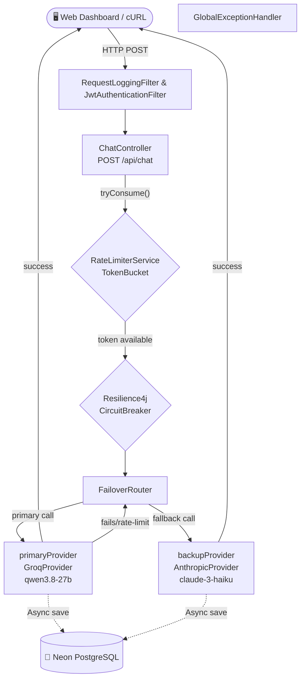

# LLM Gateway

A **Spring Boot 4** API gateway that routes chat completion requests to multiple LLM providers (Groq, OpenAI, Anthropic) with automatic failover, rate limiting, token cost tracking, and JWT authentication. It also features a stunning real-time web dashboard for analytics.

This is a backend engineering portfolio project — built to demonstrate distributed-systems fundamentals (routing, resilience, fairness, security) applied to LLM provider calls. 

---

## 🎨 Web Dashboard
The gateway comes with a premium, glassmorphism-styled dashboard served directly from Spring Boot. 
- **Admin View**: See global usage, total requests, and a real-time **Chart.js Doughnut Chart** breaking down provider distribution.
- **Developer View**: See personal token usage and estimated costs.
- **Live Chat**: Send prompts directly through the browser.

---

## Architecture



---

## Features

| Feature                        | Details                                                                                      |
| ------------------------------ | -------------------------------------------------------------------------------------------- |
| **Web Dashboard**              | Modern HTML/CSS/JS frontend for chat, login, and visual analytics (Chart.js)                 |
| **Authentication (JWT)**       | Stateless JWT security guarding the `/api/usage` and `/api/chat` endpoints                   |
| **Failover routing**           | Automatically retries backup provider when primary fails or hits rate limits                 |
| **Circuit Breaking**           | `Resilience4j` prevents cascading failures when a provider goes down                         |
| **Token-bucket rate limiting** | Per-API-key request throttling                                                               |
| **Database Persistence**       | PostgreSQL (Neon) integration via Spring Data JPA for users and request logs                 |
| **Cost Tracking**              | Asynchronous logging of prompt/completion tokens and exact USD cost calculations             |

---

## Quick Start

### Prerequisites
- Java 17+
- Neon PostgreSQL Database (or local Postgres)

### 1. Clone & Configure
```bash
git clone https://github.com/PraveenAsad1/LLM_Gateway.git
cd LLM_Gateway
```

Create a `.env` file in the root directory:
```env
# Provider Keys
GROQ_API_KEY=gsk_your_key_here
ANTHROPIC_API_KEY=sk-ant_your_key_here

# Neon DB (Make sure you use quotes around the URL to prevent bash parsing issues!)
NEON_DB_URL="jdbc:postgresql://<your-neon-pooler-url>?sslmode=require"
NEON_DB_USER=your_user
NEON_DB_PASSWORD=your_password

# Security
JWT_SECRET=supersecret123456789012345678901234567890
```

### 2. Run the Gateway
```bash
set -a; source .env; set +a; ./mvnw spring-boot:run
```

The server starts on **http://localhost:8081**.
On first boot, it will automatically connect to your Neon database, create the necessary tables, and seed two users.

### 3. Access the Dashboard
Open your web browser and go to **http://localhost:8081/**.
Log in using the hardcoded demo credentials:
- **Admin**: `admin` / `admin123`
- **Developer**: `developer` / `dev123`

---

## Configuration

Core settings in `src/main/resources/application.properties`:

```properties
# Circuit Breaker
gateway.circuitbreaker.failure-rate-threshold=50
gateway.circuitbreaker.wait-duration-in-open-state-seconds=30

# Rate limiting
gateway.ratelimit.capacity=20
gateway.ratelimit.refill-per-second=5

# Groq
gateway.groq.api-key=${GROQ_API_KEY:}
gateway.groq.model=qwen/qwen3.8-27b
```

## Tech Stack

- **Backend**: Spring Boot 4, Spring Security, Spring Data JPA
- **Database**: PostgreSQL (Neon) via HikariCP
- **Resilience**: Resilience4j (Circuit Breaker)
- **Frontend**: HTML5, Vanilla CSS (Glassmorphism), Chart.js
- **Auth**: io.jsonwebtoken (jjwt)
