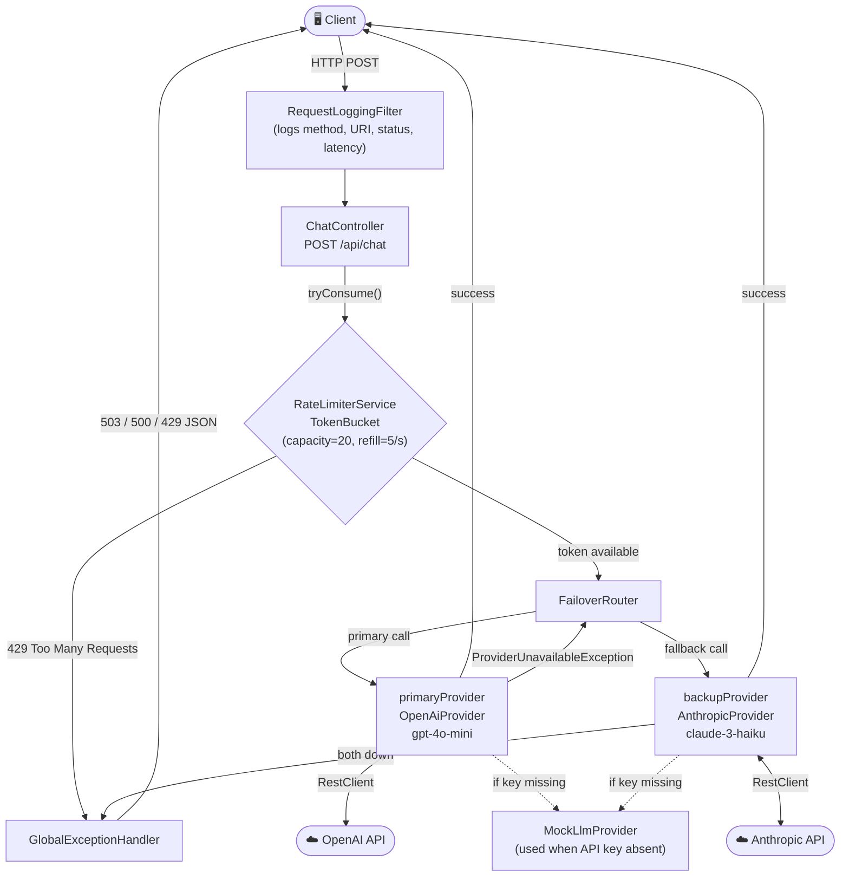

# LLM Gateway

A **Spring Boot 4** API gateway that routes chat completion requests to
multiple LLM providers (OpenAI, Anthropic) with automatic failover,
rate limiting, and request logging.

This is a backend engineering portfolio project — built to demonstrate
distributed-systems fundamentals (routing, resilience, fairness) applied
to LLM provider calls, not a finished production system. See **What's
Not Here Yet** below for an honest account of scope.

---

## Architecture



---

## Features

| Feature                        | Details                                                                                      |
| ------------------------------ | -------------------------------------------------------------------------------------------- |
| **Failover routing**           | Automatically retries backup provider when primary throws `ProviderUnavailableException`     |
| **Token-bucket rate limiting** | 20-token burst capacity, refills at 5 tokens/sec (configurable)                              |
| **Real LLM providers**         | OpenAI Chat Completions API & Anthropic Messages API via Spring `RestClient`                 |
| **Mock providers**             | Safe fallback when API keys are not configured — app always starts                           |
| **Request logging**            | Every request logged with method, URI, remote IP, HTTP status, and latency                   |
| **Global error handling**      | Clean JSON error responses: `503` (providers down), `429` (rate limited), `500` (unexpected) |

---

## What's Not Here Yet (and why)

Being upfront about scope boundaries rather than overstating what's built:

| Missing piece | Why it's not here | What it would take |
|---|---|---|
| **Cache eviction** | The rate limiter's `ConcurrentHashMap` grows unbounded as new API keys are seen. Stale keys are never removed, which is fine for a portfolio project but a memory leak in production. | Replacing `ConcurrentHashMap` with a caching library like Caffeine to evict keys based on TTL or size. |
| **Auth Scoping** | For simplicity, users own exactly one API key. Real systems would support one-to-many or team-based key ownership. | A relational table linking multiple keys to a user/tenant. |
| **Failed requests are not logged** | The cost tracker only persists successful provider calls. Requests that fail entirely (e.g. 503) or rate-limit rejections (429) are completely unrecorded. | Modifying the global exception handler and rate limiter to push failure events down to the async logger. |
| **Admin/user dashboard** | No UI exists yet — usage data is only visible via raw API response. | A small React dashboard once cost persistence exists underneath it. |
| **In-memory usage aggregation** | `GET /api/usage/summary` pulls all `RequestLog` rows into memory via `findAll()` and sums them using Java Streams. This will OOM at scale. | Moving the SUM/GROUP BY logic down into JPA `@Query` or native SQL. |
| **Horizontal scaling** | Rate limiting is in-memory and per-instance — running two gateway instances would not share rate-limit state, so a client could exceed their real limit by hitting different instances. | Redis-backed token buckets shared across instances. |

This list is deliberate, not an oversight — each row reflects a scoping
decision made to keep the project finishable, not a gap discovered after
the fact.

---

## Project Structure

```
src/main/java/com/praveen/llm_gateway/
├── LlmGatewayApplication.java          # Spring Boot entry point
│
├── api/
│   ├── ChatController.java             # POST /api/chat
│   ├── exception/
│   │   ├── ErrorResponse.java          # JSON error payload record
│   │   └── GlobalExceptionHandler.java # @ControllerAdvice — 429 / 503 / 500
│   └── filter/
│       └── RequestLoggingFilter.java   # Servlet filter — logs all requests
│
├── config/
│   └── ProviderConfig.java             # Wires primary/backup provider beans
│
├── model/
│   ├── GatewayRequest.java             # record(apiKey, prompt, model)
│   └── GatewayResponse.java            # record(content, providerUsed, promptTokens, completionTokens)
│
├── provider/
│   ├── LlmProvider.java                # Interface: GatewayResponse call(GatewayRequest)
│   ├── OpenAiProvider.java             # Calls OpenAI /v1/chat/completions
│   ├── AnthropicProvider.java          # Calls Anthropic /v1/messages
│   ├── MockLlmProvider.java            # Stub — used when API key is absent
│   └── ProviderUnavailableException.java
│
├── ratelimit/
│   ├── TokenBucket.java                # Thread-safe token bucket implementation
│   ├── RateLimiterService.java         # @Service wrapping TokenBucket
│   └── RateLimitExceededException.java # Extends ResponseStatusException (429)
│
└── router/
    └── FailoverRouter.java             # Routes primary → backup on failure
```

---

## Quick Start

### Prerequisites

- Java 17+ (tested on Java 25)
- Maven wrapper included (`./mvnw`)

### 1. Clone & configure

```
git clone https://github.com/PraveenAsad1/LLM_Gateway.git
cd LLM_Gateway
```

Set your API keys as environment variables (optional — mocks are used if absent):

```
export OPENAI_API_KEY=sk-...
export ANTHROPIC_API_KEY=sk-ant-...
```

### 2. Run

```
./mvnw spring-boot:run
```

The server starts on **http://localhost:8080**.

### 3. Send a request

```
curl -X POST http://localhost:8080/api/chat \
  -H "Content-Type: application/json" \
  -d '{
    "apiKey": "your-key",
    "prompt": "Explain the difference between REST and GraphQL",
    "model": "gpt-4o-mini"
  }'
```

**Success response (200):**

```json
{
  "content": "REST uses fixed endpoints...",
  "providerUsed": "openai/gpt-4o-mini",
  "promptTokens": 18,
  "completionTokens": 142
}
```

**Rate limit response (429):**

```json
{
  "error": "Too Many Requests",
  "message": "Rate limit exceeded. Please slow down and try again shortly."
}
```

**All providers down (503):**

```json
{
  "error": "Service Unavailable",
  "message": "All LLM providers are currently unavailable. Please try again later."
}
```

---

## Configuration

All settings live in `src/main/resources/application.properties`:

```properties
# Rate limiting
gateway.ratelimit.capacity=20          # burst capacity (tokens)
gateway.ratelimit.refill-per-second=5  # sustained throughput

# OpenAI
gateway.openai.api-key=${OPENAI_API_KEY:}
gateway.openai.model=gpt-4o-mini
gateway.openai.timeout-seconds=30

# Anthropic
gateway.anthropic.api-key=${ANTHROPIC_API_KEY:}
gateway.anthropic.model=claude-3-haiku-20240307
gateway.anthropic.timeout-seconds=30
gateway.anthropic.version=2023-06-01
```

---

## Tech Stack

| Technology          | Version | Purpose                     |
| ------------------- | ------- | --------------------------- |
| Spring Boot         | 4.1.1   | Application framework       |
| Spring Web (Tomcat) | 6.x     | REST API + Servlet filter   |
| Spring `RestClient` | 6.1+    | HTTP calls to LLM providers |
| Java Records        | 16+     | Immutable DTOs              |
| SLF4J / Logback     | —       | Structured logging          |
| Maven Wrapper       | —       | Build tooling               |

---

## Failover Flow

```
Request arrives
    │
    ▼
RateLimiterService.tryConsume()
    │ token available                  │ bucket empty
    ▼                                  ▼
FailoverRouter.route()           429 Too Many Requests
    │
    ├─► primaryProvider.call()
    │       │ success → return response
    │       │ ProviderUnavailableException ↓
    │
    └─► backupProvider.call()
            │ success → return response
            │ ProviderUnavailableException ↓
            503 Service Unavailable
```

---

## License

MIT
